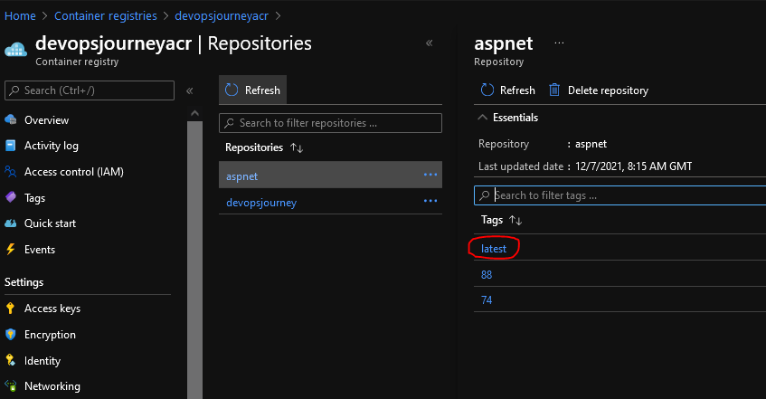

# Automated deployment of your AKS Application

In previous labs; the application was initially manually setup for its build tag. In CI/CD, this would be automated and the Application on the AKS cluster would update each time the pipeline has been ran.

In this lab, we will be looking at creating an automated deployment for your AKS Application

1. Reviewing the aspnet.yaml file, you will notice in a previous lab that the image build version has been hardcoded. Each time you require to update the pods on the cluster, you will actually have to delete the k8s deployment and re-run pipeline with the later build version. This is not ideal; we want zero downtime deployments!

`        image: devopsjourneyacr.azurecr.io/aspnet:74`

2. Change the image tag to `latest` and also introduce an `imagePullPolicy`

`        image: devopsjourneyacr.azurecr.io/aspnet:latest
        imagePullPolicy: Always`

The imagePullPolicy for a container and the tag of the image affect when the kubelet attempts to pull (download) the specified image.

Here's a list of the values you can set for imagePullPolicy and the effects these values have:

IfNotPresent
the image is pulled only if it is not already present locally.
Always
every time the kubelet launches a container, the kubelet queries the container image registry to resolve the name to an image digest. If the kubelet has a container image with that exact digest cached locally, the kubelet uses its cached image; otherwise, the kubelet pulls the image with the resolved digest, and uses that image to launch the container.
Never
the kubelet does not try fetching the image. If the image is somehow already present locally, the kubelet attempts to start the container; otherwise, startup fails

3. Edit your aspnet.yaml file with these [two changes](labs/5-CICD/pipelines/scripts/aspnet.yaml#L19-L20)

4. Now that the application .yaml has been updated, time to update the pipeline tag, previous it was: 

`          tags: $(Build.BuildId)`

Which will tag with the latest BuildId each time of the pipeline. 

Update to `latest`

`          tags: 'latest '`

[Refer this](labs/5-CICD/pipelines/lab5pipeline.yaml#L143)

5. Once you have merged these changes - the pipeline will automatically run! Checking the ACR you will notice a new Tag `latest` will be displayed

As we changed the `imagePullPolicy` to `Always`, reviewing the K8s cluster, you will see a new pod also with the `latest` image tag

`kubectl describe pod aspnetcore | grep Image
Image:          devopsjourneyacr.azurecr.io/aspnet:latest`

Awesome, your first introduction to CI/CD and automated deployments!

